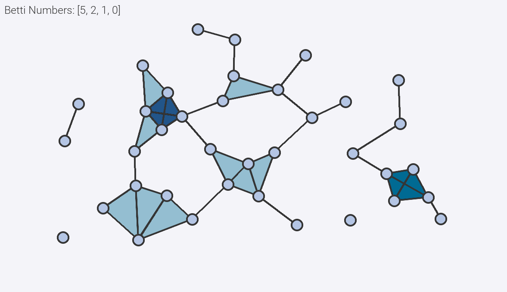

# Betti Numbers

## Description
This repository computes Betti numbers of a topological space. The Betti numbers of a topological space can be computed by first [triangulating](https://en.wikipedia.org/wiki/Triangulation_(topology)) the space by a [simplicial complex](https://en.wikipedia.org/wiki/Simplicial_complex), then representing this complex as a collection of boundary matrices, and lastly performing some reduction on these boundary matrices.

This repository contains modules for storing simplicial complexes in the following formats:
- Boundary matrix collection
  + `simplicial.boundary_matrix.BoundaryMatrix`
- Sparse boundary matrix collection
  + `simplicial.boundary_matrix.SparseBoundaryMatrix`
- Simplex tree
  + `simplicial.simplex_tree.SimplexTree`
  + See [this paper](https://arxiv.org/abs/2001.02581) by Boissonnat & Maria for a definition.

The original purpose of this repository was to implement in code a general tool for solving the exercises given in Edelsbrunner and Harer's *Computational Topology: An Introduction*. Given there as exercises are a computation of the Betti numbers of the 2-dimensional [Klein bottle](https://en.wikipedia.org/wiki/Klein_bottle), as well as a triangulation of the [dunce cap](https://en.wikipedia.org/wiki/Dunce_hat_(topology)) and a verification of its Betti numbers. (The latter is posed as a high difficulty problem and indeed is significantly more involved; see `examples/boundary_matrix_examples.py`.)

### Betti Numbers
Betti numbers can be thought of as a count of p-dimensional holes in a topological space for positive dimension p. The 0th Betti number of a space is rather better thought of as a count of its disconnected components. The Betti numbers of a space are computed by finding the rank of the p-th homology group Hp of a triangulating simplicial complex. Such a complex can be represented as a collection of boundary matrices describing the (p-1)-dimensional boundaries of each p-simplex in the complex.

### Boundary Matrices
The p-th boundary matrix of a complex is a relatively simple construct. Given a dimension p and an arbitrary indexing of the p-simplices and (p-1)-simplices of the complex, the p-th boundary matrix has **aij = 1** if the i-th (p-1)-simplex is a face of the j-th p-simplex and **aij = 0** otherwise. By computing the Smith normal form of the boundary matrices of a complex, one can easily compute the ranks of its p-th cycle groups Zp and (p-1)-th boundary groups Bp-1. These appear as the zero columns and non-zero rows, respectively. If these ranks are computed for all dimensions p, then the ranks of the p-th homology groups (i.e. the Betti numbers of the space) can be computed by the differences **rank(Hp) = rank(Zp) - rank(Bp)**.

### Euler Characteristic
Computing the Betti numbers of a space also enables us to compute its [Euler characteristic](https://en.wikipedia.org/wiki/Euler_characteristic). By the Euler-Poincaré theorem, the Euler characteristic of a topological space is merely the alternating sum of its Betti numbers. A few examples of Euler characteristic are given in `examples.py`.

### Reduced Betti Numbers
Reduced Betti numbers give a somewhat more intuitive and pleasing result when interpreting Betti numbers as p-dimensional holes. In brief, they are equivalent to the standard Betti numbers except in the case of p=0, where the reduced 0th Betti number is given by the 0th Betti number minus one. This guarantees that the 0th reduced Betti number counts gaps between disconnected vertices (i.e. 0-dimensional holes). Techinically, the procedure of reducing boundary matrices of a triangulating complex produces the reduced Betti numbers of a space. The `SimplicialComplex` class here stores the standard Betti numbers after their computation, however both forms are retrievable through their respective class methods.

### Limitations
Unfortunately, this approach to representing topological spaces and computing their Betti numbers is untenable for large complexes, as the boundary matrices of a complex are generally sparse and quite large. A sparse-matrix implementation would yield greater efficiency for larger complexes.

## Example
To find the Betti numbers of the 3-dimensional ball, we can triangulate it with a single tetrahedron and find each p-th boundary matrix describing this tetrahedron.

  

~~~
'''
Compute the Betti numbers of the 3-ball triangulated by a single tetrahedron.
'''
ball = SimplicialComplex()

# Add vertices
ball.add_boundary_matrix(0, np.array([
    [1,1,1,1]
]))

# Relate vertices (rows) to edges (columns)
ball.add_boundary_matrix(1, np.array([
    [1,1,1,0,0,0],
    [1,0,0,1,1,0],
    [0,1,0,1,0,1],
    [0,0,1,0,1,1]
]))

# Relate edges (rows) to faces (columns)
ball.add_boundary_matrix(2, np.array([
    [1,1,0,0],
    [1,0,1,0],
    [0,1,1,0],
    [1,0,0,1],
    [0,1,0,1],
    [0,0,1,1]
]))

# Relate faces (rows) to solid interior (column)
ball.add_boundary_matrix(3, np.array([
    [1],
    [1],
    [1],
    [1]
]))

# Expected: [1,0,0,0]
print(f'3-Ball: {ball.get_betti_numbers()}')
~~~

When executed, this code outputs:
~~~
3-Ball: [1, 0, 0, 0]
~~~
These are the expected Betti numbers of the 3-ball. All of the p-th Betti numbers vanish for positive p, which matches our intuition that a solid ball has no holes.

Additional examples regarding the following spaces are provided in `examples.py`:
- The 2-dimensional sphere
- The klein bottle
- The torus
- The mobius strip
- The cylinder
- The dunce cap

## Drawing Tool Instructions

The drawing tool allows a user to draw up to 2-dimensional simplicial complexes. To draw a simplicial complex:
1. Click to add vertices to the complex.
2. Click existing vertices to select them (up to 4), and press `space` to add/remove the corresponding simplex.
3. Right click a single vertex to remove it, or right click the canvas background to clear the current selection.
5. Press `r` to reset the drawing area.

 

  

