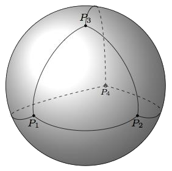

# Computing Betti Numbers

## Description
This repository computes Betti numbers of a topological space. These Betti numbers can be computed by first triangulating the topological space by a simplicial complex, then representing this complex as a collection of boundary matrices, and lastly performing some reduction on these matrices. The original purpose of this repository was programatically solve the problem of finding the Betti numbers of the 2-dimensional Klein bottle, given as an exercise in Edelsbrunner and Harer's *Computational Topology: An Introduction*.

### Betti Numbers
Betti numbers can be thought of as a count of p-dimensional holes in a topological space. They are computed by finding the rank of p-th homology group Hp of a triangulating simplicial complex of a space. Such a complex can be described as a collection of boundary matrices describing the (p-1)-dimensional boundaries of each p-simplex in the simplicial complex.

### Boundary Matrices
The p-th boundary matrix of a complex is a relatively simple construct. Given a dimension p and an arbitrary indexing of the p-simplices and (p-1)-simplices of the complex, the p-th boundary matrix has **aij = 1** if the i-th (p-1)-simplex is a face of the j-th p-simplex and **aij = 0** otherwise. By computing the Smith normal form of these boundary matrices, one can easily compute the ranks of the p-th cycle groups Zp and (p-1)-th boundary groups Bp-1. These appear as the zero columns and non-zero rows, respectively. If these ranks are computed for all dimensions p, then the ranks of the p-th homology groups (i.e. the Betti numbers of the space) can be computed by the differences **rank(Hp) = rank(Zp) - rank(Bp)**.

### Euler Characteristic
Computing the Betti numbers of a space also enables us to compute the Euler characteristic of that space. By the Euler-Poincaré theorem, the Euler characteristic of a topological space is merely the alternating sum of its Betti numbers. A few examples of Euler characteristic are given in `examples.py`.

### Limitations
Unfortunately, this approach is untenable for large complexes, as the boundary matrices of a complex are generally sparse and quite large.

## Example
To find the Betti numbers of the 3-dimensional ball, we can triangulate it with a single tetrahedron and find each p-th boundary matrix describing this tetrahedron.

  

~~~
'''
Compute the Betti numbers of the 3-ball triangulated by a single tetrahedron.
'''
ball = SimplicialComplex()

# Add vertices
ball.add_boundary_matrix(0, np.array([
    [1,1,1,1]
]))

# Relate vertices (rows) to edges (columns)
ball.add_boundary_matrix(1, np.array([
    [1,1,1,0,0,0],
    [1,0,0,1,1,0],
    [0,1,0,1,0,1],
    [0,0,1,0,1,1]
]))

# Relate edges (rows) to faces (columns)
ball.add_boundary_matrix(2, np.array([
    [1,1,0,0],
    [1,0,1,0],
    [0,1,1,0],
    [1,0,0,1],
    [0,1,0,1],
    [0,0,1,1]
]))

# Relate faces (rows) to solid interior (column)
ball.add_boundary_matrix(3, np.array([
    [1],
    [1],
    [1],
    [1]
]))

# Expected: [1,0,0,0]
print(f'3-Ball: {ball.get_betti_numbers()}')
~~~

When executed, this code outputs:
~~~
3-Ball: [1, 0, 0, 0]
~~~
These are the expected Betti numbers of the 3-ball. All of the p-th Betti numbers vanish for positive p, which matches our intuition that a solid ball has no holes.

Additional examples regarding the following spaces are provided in `examples.py`:
- The 2-dimensional sphere
- The klein bottle
- The torus
- The mobius strip
- The cylinder